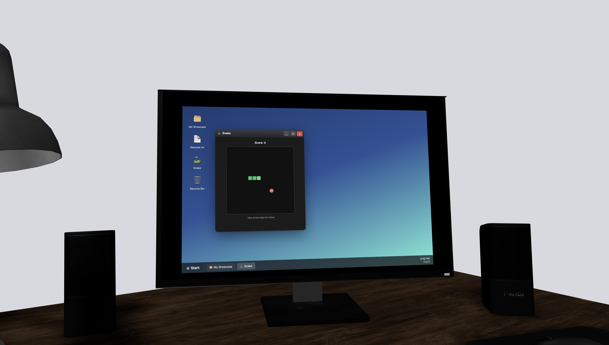

# 🏢 3D Interactive Portfolio

An immersive portfolio website built around a custom 3D office environment — modeled in Blender,
rendered in the browser with Three.js, and complete with a **fully playable Snake game running on
the office's virtual desktop monitor**.

Instead of scrolling through another static portfolio, visitors step into a space they can explore,
navigate, and actually play with.

### 🔗 [Launch the Experience](Coming soon)

> 💻 Best viewed on desktop.



---

## 🎯 About

I wanted my portfolio to demonstrate frontend engineering ability rather than just describe it.
So instead of a conventional single page site, I modeled and partially design3ed a 3D office in Blender,
brought it into the browser with Three.js, and built the entire portfolio experience inside it —
cinematic lighting, animated camera movement, parallax depth, and an interactive desktop you can
sit down at and use.

The centerpiece is the office computer: a working Snake game rendered on the monitor inside the 3D
scene. It's a small thing, but it's the kind of detail that makes someone remember the site and
building it meant solving real problems around rendering interactive content inside a 3D
environment.

---

## ✨ Features

### 🏢 Interactive 3D Office
- **Custom Blender Environment** — office building modeled and edited from scratch, exported for web
- **Three.js Rendering** — real-time WebGL rendering of the full scene
- **Cinematic Lighting & Effects** — layered lighting and visual polish for a premium feel
- **Animated Camera Movement** — smooth, cinematic transitions as you move through the space
- **Parallax Depth** — layered motion that reinforces the sense of a real environment

### 🎮 Playable Desktop
- **Embedded Snake Game** — a fully functional Snake game running on the office monitor
- **Direct Screen Interaction** — click into the computer and play without leaving the scene
- **Guided Entry** — a start screen eases visitors into the experience on load

### 🧩 Portfolio Sections
- **Project Showcase** — featured software engineering work
- **Skills & Technologies** — technical stack and tooling
- **About Me** — background and focus
- **Contact** — ways to get in touch

### 🎨 Design & Architecture
- **Framer Motion Animations** — fluid transitions throughout the UI
- **Responsive Design** — adapts across desktop and mobile
- **Smooth Scrolling** — polished navigation between sections
- **Modular Component Architecture** — reusable components built for maintainability and scale

---

## 🛠️ Tech Stack

| Layer | Technology |
|---|---|
| **Framework** | React |
| **Language** | JavaScript / TypeScript |
| **3D Rendering** | Three.js |
| **3D Modeling** | Blender |
| **Animation** | Framer Motion |
| **Styling** | Tailwind CSS |
| **Build Tool** | Vite |
| **Audio** | Ambient office soundscape + interaction feedback |

---

## 📁 Project Structure

```
3d-portfolio/
│
├── src/                      # Application source
│   ├── components/           # Reusable React components
│   ├── assets/               # 3D models, textures, audio
│   └── main.jsx              # Application entry point
│
├── index.html                # HTML entry point
├── vite.config.js            # Vite build configuration
├── tailwind.config.js        # Tailwind theme configuration
├── postcss.config.js         # PostCSS / Tailwind pipeline
└── package.json              # Dependencies and scripts
```

---

## 🚀 Getting Started

### Prerequisites

- **Node.js 18+** and npm

### Installation

1. **Clone the repository**

```bash
git clone https://github.com/JamesCicerello/3d-portfolio.git
cd 3d-portfolio
```

2. **Install dependencies**

```bash
npm install
```

3. **Start the development server**

```bash
npm run dev
```

Then open the local URL printed in your terminal.

### Available Scripts

| Command | Description |
|---|---|
| `npm run dev` | Start the development server |
| `npm run build` | Build for production |
| `npm run preview` | Preview the production build locally |

---

## 🎨 Credits

Audio assets sourced from the [Freesound](https://freesound.org/) community.

---

## 👤 Author

**James Cicerello**
Computer Science Student 

[LinkedIn](www.linkedin.com/in/james-cicerello-b8246a395)
